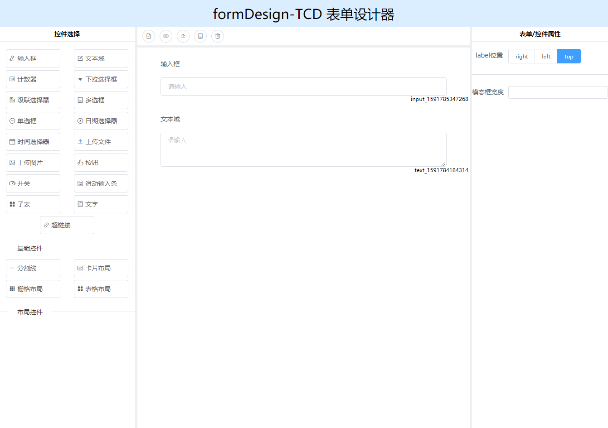

# 组件
form-design-tcd内置了两个组件分别为FormDesignTCD和FormBuildTCD。

## FormDesignTCD
::: tip
表单设计器组件
:::
### 1.基础使用
#### 例子
``` js
<template>
  <div>
      <FormDesignTCD/>
  </div>
</template>
```
零配置使用FormDesignTCD,高度会自动占满父级  
  
  


### 2.传入默认值
#### 例子
``` js
<template>
    <div>
        <FormDesignTCD
            :ref="fdt"
            :defaultValue="defaultValue"
        />
  </div>
</template>
export default {
    methods:{
        //如果想手动改变FormDesignTCD的数据可以用以下写法,
        //效果和传defaultValue是一样的,根据不同场景你可以2选一
        this.$refs.fdt.setDesignData(this.defaultValue)
    },
    data(){
        return{
            defaultValue:{
               config: {
                  labelPosition: "top",
                  labelWidth: 15,
               },
               list: [
                   {
                   type: "input",
                   label: "输入框",
                   options: {
                       label: "输入框",
                       minWidth: 10,
                       width: 100,
                       defaultValue: "",
                       placeholder: "请输入",
                       clearable: false,
                       hidden: false,
                       disabled: false
                   },
                   model: "input_1591785347268",
                   key: "input_1591785347268",
                   rules: [
                        {
                        	required: false,
                        	message: "必填项",
                        	trigger: "blur"
                        }
                   ]
                   },
               {
                   type: "text",
                   label: "文本域",
                   options: {
                       minWidth: 10,
                       width: 100,
                       height: 3,
                       defaultValue: "",
                       placeholder: "请输入",
                       clearable: false,
                       hidden: false,
                       disabled: false
                   },
                       model: "text_1591784184314",
                       key: "text_1591784184314",
                       rules: [
                          {
                              required: false,
                        	  message: "必填项",
                        	  trigger: "blur"
                          }
                       ]
                   }
               ]
           } 
        }
    }
}
```
::: tip
当传入默认值时,设计器里的内容是对默认值解析的控件展示。
:::

::: danger
在使用FormDesignTCD的defaultValue时，切记传入的json对象格式，如果格式错误会导致一系列意想不到的错误。
:::
### 3.控件选择面板控制
#### 例子
``` js
<template>
  <div>
      <FormDesignTCD
          :baseList="['input','text','number']"
          :layoutBaseList="['grid']"
      />
  </div>
</template>
```
传入baseList和layoutBaseList时,会控制左侧控件选择面板可选择的控件  
  
   

``` js
//baseList和layoutBaseList的可选值如下,如果不传默认全部显示
baseList:["input","text","number","select","checkbox","radio","date","time","uploadFile","uploadImg","button","switch","slider","p","super","childTable","cascader"]
layoutBaseList:["divider","card","grid","table"]
``` 
  
### 4.获取数据
#### 例子
``` js
<template>
  <div>
      <FormDesignTCD
          ref="fdt"
          @save="handleSave"
      />
  </div>
</template>
export default {
    methods:{
        handleSave(value){
            console.log(value)
        }
    }
}
```
  
在FormDesignTCD组件上监听save函数,点击按钮栏保存按钮时会触发,并传出生成json数据。  
或者:
  
``` js
  this.$refs.fdt.save()
  //触发保存内置事件
```
#### 内置函数
| 函数名        | 说明           | 参数  | 返回值    |
| ------------- |:-------------:| ----- | ---------|
| save          | 触发保存事件   |       |undefined |
## FormBuildTCD
::: tip
表单解析器组件(解析FormDesignTCD生成的json)
:::
### 基础使用
#### 例子
``` js
<template>
  <FormBuildTCD
     :options="options"
  />
</template>
export default {
    data(){
        return{
            options:{
               config: {
                  labelPosition: "top",
                  labelWidth: 15,
               },
               list: [
                   {
                   type: "input",
                   label: "输入框",
                   options: {
                       label: "输入框",
                       minWidth: 10,
                       width: 100,
                       defaultValue: "",
                       placeholder: "请输入",
                       clearable: false,
                       hidden: false,
                       disabled: false
                   },
                   model: "input_1591785347268",
                   key: "input_1591785347268",
                   rules: [
                        {
                        	required: false,
                        	message: "必填项",
                        	trigger: "blur"
                        }
                   ]
                   },
               {
                   type: "text",
                   label: "文本域",
                   options: {
                       minWidth: 10,
                       width: 100,
                       height: 3,
                       defaultValue: "",
                       placeholder: "请输入",
                       clearable: false,
                       hidden: false,
                       disabled: false
                   },
                       model: "text_1591784184314",
                       key: "text_1591784184314",
                       rules: [
                          {
                              required: false,
                        	  message: "必填项",
                        	  trigger: "blur"
                          }
                       ]
                   }
               ]
           } 
        }
    }
}
```
 
使用FormBuildTCD的必传项是options,且options必须是符合FormDesignTCD生成的格式
### 表单数据
默认情况下FormBuildTCD中表单的初始值,是根据传入的options映射出来的;但是如果传入defaultValue那么将会以此对象作为表单初始值。
#### 例子
``` js
<template>
  <FormBuildTCD
     :ref="fbt"
     :options="options"
  />
  <button @click="getData"/>
</template>
export default {
    methods:{
        getData(){
            console.log(this.$refs.fbt.getFormData())
        }
    },
    data(){
        return{
            options:{
               config: {
                  labelPosition: "top",
                  labelWidth: 15,
               },
               list: [
                   {
                   type: "input",
                   label: "输入框",
                   options: {
                       label: "输入框",
                       minWidth: 10,
                       width: 100,
                       defaultValue: "",
                       placeholder: "请输入",
                       clearable: false,
                       hidden: false,
                       disabled: false
                   },
                   model: "input_1591785347268",
                   key: "input_1591785347268",
                   rules: [
                        {
                        	required: false,
                        	message: "必填项",
                        	trigger: "blur"
                        }
                   ]
                   },
               {
                   type: "text",
                   label: "文本域",
                   options: {
                       minWidth: 10,
                       width: 100,
                       height: 3,
                       defaultValue: "",
                       placeholder: "请输入",
                       clearable: false,
                       hidden: false,
                       disabled: false
                   },
                       model: "text_1591784184314",
                       key: "text_1591784184314",
                       rules: [
                          {
                              required: false,
                        	  message: "必填项",
                        	  trigger: "blur"
                          }
                       ]
                   }
               ]
           } 
        }
    }
}
```
点击按钮打印出  

  
  
    
### 通过监听buildSubmit事件拿到表单数据

``` js
<template>
  <FormBuildTCD
     :ref="fbt"
     :options="options"
     @buildSubmit="getData" 
  />
</template>
export default {
    methods:{
        getData(formData){
            console.log(formData)
        }
    },
    data(){
        return{
            options:{
               config: {
                  labelPosition: "top",
                  labelWidth: 15,
               },
               list: [
                   {
                   type: "input",
                   label: "输入框",
                   options: {
                       label: "输入框",
                       minWidth: 10,
                       width: 100,
                       defaultValue: "",
                       placeholder: "请输入",
                       clearable: false,
                       hidden: false,
                       disabled: false
                   },
                   model: "input_1591785347268",
                   key: "input_1591785347268",
                   rules: [
                        {
                        	required: false,
                        	message: "必填项",
                        	trigger: "blur"
                        }
                     ]
                   },
                   {
                   type: "text",
                   label: "文本域",
                   options: {
                       minWidth: 10,
                       width: 100,
                       height: 3,
                       defaultValue: "",
                       placeholder: "请输入",
                       clearable: false,
                       hidden: false,
                       disabled: false
                   },
                       model: "text_1591784184314",
                       key: "text_1591784184314",
                       rules: [
                          {
                              required: false,
                        	  message: "必填项",
                        	  trigger: "blur"
                          }
                       ]
                   },
                   {
                       type: "button",
                       label: "按钮",
                       options: {
                           width: 0,
                           maxWidth: 80,
                           buttonType: "primary",
                           handle: "submit",
                           dynamicFun: "",
                           disabled: false
                       },
                          key: "button_1591871606688"
                   }
               ]
            } 
        }
    }
}
```
通过监听buildSubmit事件，当点击表单内置的按钮（按钮类型需要设为提交（submit））可以拿到表单的数据。

#### 事件
| 函数名        | 说明           | 返回参数  | 返回值    |
| ------------- |:-------------:| ----- | ---------|
| buildSubmit   | 点击FormBuildTCD生成的按钮时触发|formData|undefined |
|onSuccess      |图片或文件控件上传成功时触发|response, file, fileList, model(model参数为该上传控件对应的字段)|undefined|
|beforeUpload   |图片或文件控件上传之前触发|file, model(model参数为该上传控件对应的字段)|undefined|
  
  
 
### 动态数据dynamicData
#### 例子
``` js
<template>
  <FormBuildTCD
     :dynamicData="dynamicData"
     :options="options"
  />
</template>
```
  

  


## API
### 修改内置属性setDesignConfig

如果你想对FormDesignTCD组件进行一些全局默认值的修改,比如你想把拖入模板区的,每一个图片上传控件的上传地址都预先设置一个值的话,你可以

``` js
//项目main.js中
import Vue from 'vue'
import {setDesignConfig} from 'form-design-tcd'
import FormDesignTCD from 'form-design-tcd'
Vue.use(FormDesignTCD)

setDesignConfig({
   uploadImg:{
       action:"www.baidu.com"
   } 
})
//setDesignConfig函数参数是一个对象,对象中属性的key就是控件的type
```
这样每一个被拖入的上传图片控件的上传地址都被改成了www.baidu.com。

你也可以用setDesignConfig函数为表单设计器预设一些高级设置

``` js
import {setDesignConfig} from 'form-design-tcd'

setDesignConfig({
   uploadImg:{
       headers:""//给上传控件添加请求头信息
       data:""//给上传文件添加一些携带参数
       name:""//上传文件名
   } 
})
```
根据这个规律,你可以用setDesignConfig函数做很多事情(这里只列举了可能常用的)  
如果都列出来哈哈哈哈哈哈哈哈,可能这篇文档还要做个懒加载,并且还得可爱的你有耐心去读那么长的代码片段  
如果你对这部分功能有需要的话,去看一下源码setDesignConfig函数定义在object/index.js文件下  

[form-design-tcd](https://github.com/zimudehub/FormDesignTCD) 

### 修改FormBuildTCD组件解析函数serBuildConfig

serBuildConfig函数和setDesignConfig函数功能差不多,但是serBuildConfig是一个功能性函数,它会帮助你对FormDesignTCD组件设计出来的json
做一次改造,改造之后再作为FormDesignTCD组件的options传入,得到改造后的表单json,与setDesignConfig不一样,你可以在任何地方引用serBuildConfig,具体使用如下
#### 例子
``` js
import {serBuildConfig} from 'form-design-tcd'
//serBuildConfig接收三个参数分别是
//第一个参数 buildArray(数组类型)需要被修改的数组,就是FormDesignTCD设计出来的data.list
//第二个参数 config(对象类型) 要修改或增加的数据(和setDesignConfig函数的参数config一样)
//第三个参数 model(字符串类型,可选)如果传了则会只对对应的model字段的控件做修改,
//不传则对所有的config参数中传入的控件类型做修改
let options = {
               config: {
                  labelPosition: "top",
                  labelWidth: 15,
               },
               list: [
                   {
                   type: "input",
                   label: "输入框",
                   options: {
                       label: "输入框",
                       minWidth: 10,
                       width: 100,
                       defaultValue: "",
                       placeholder: "请输入",
                       clearable: false,
                       hidden: false,
                       disabled: false
                   },
                   model: "input_1591785347268",
                   key: "input_1591785347268",
                   rules: [
                        {
                        	required: false,
                        	message: "必填项",
                        	trigger: "blur"
                        }
                     ]
                   },
                   {
                   type: "text",
                   label: "文本域",
                   options: {
                       minWidth: 10,
                       width: 100,
                       height: 3,
                       defaultValue: "",
                       placeholder: "请输入",
                       clearable: false,
                       hidden: false,
                       disabled: false
                   },
                       model: "text_1591784184314",
                       key: "text_1591784184314",
                       rules: [
                          {
                              required: false,
                        	  message: "必填项",
                        	  trigger: "blur"
                          }
                       ]
                   },
                   {
                       type: "button",
                       label: "按钮",
                       options: {
                           width: 0,
                           maxWidth: 80,
                           buttonType: "primary",
                           handle: "submit",
                           dynamicFun: "",
                           disabled: false
                       },
                          key: "button_1591871606688"
                   }
               ]
           }
setDesignConfig(options.list,{
   uploadImg:{
       headers:""//给上传控件添加请求头信息
       data:""//给上传文件添加一些携带参数
       name:""//上传文件名
   } 
}, photo)
//这里就是对options做个修改,然后把修改完的options传入FormBuildTCD组件,
//就对对应name字段的上传图片控件做了修改
```
如果你对serBuildConfig有需求,也建议看一下源码这里列出来会那么那么长(哈哈哈哈哈)也在object/index.js文件里
